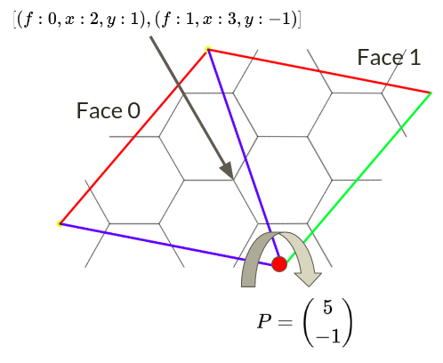

# Capsidlib
Capsidlib is a python library for generating and studying the graphs associated with the graphs of viral capsids. 

# Required libraries
* The `networkx` library is used to handle operations on graph.
* The `matplotlib`, `numpy` and `python-ternary` libraries are used to create figures

# Graph analysis
The graph analyser module provides tools to compute informations on the strength of different capsid graphs. This module supports networkx graphs with weighted nodes and can give insight on the ability of a capsid to resist to both the removal of bonds (edges in the graph) and proteins (nodes in the graph).
## Non weighted graphs
Modelling a viral capsid with a non weighted graph to model is equivalent to ignoring the energetic aspect of the bonds between proteins when removing them.
### Fragmentation probability
For a graph that does not have weighted edges, the function `getFragmentationProbability` approximates the probability that the graph $G$ will fragment when each nodes or edges are removed with a probability of $p$. THe value is determined with a Monte Carlo method : for each simulation we determine whether or not to remove each nodes / edges with the built-in `random` function and then checking the connectivity of the graph using networkx function `is_connected`. The number of simulation is determined by the dictionary `stopCondition`.  
The entry `conditionType` of this parameter can take two values:
* `fixedIterations`: stops after the amount of iterations provided by `iterations`
* `dichotomy`: stops after the probability of the value being invalid for the computation of the percolation threshold is below `errorProbability` (read Percolation threshold for more details). As the amount of iterations required to get under that probability is unbounded, a maximum of iterations is required. After this amount of iterations, the programs return the current estimation. 
The first value returned is the estimation and the second one indicates whether or not the maximum amount of iterations has been reached. 

### Percolation threshold
The function `getPercolationThreshold` uses a dichotomic algorithm to approximate the threshold probability of removal for which the probability of fragmentation is 0.5, i.e the percolation threshold. The probability of the final value being incorrect is bounded by the parameter `errorProbability`. This function uses `getFragmentationProbability` to determine whether or not the probability of fragmentation for a given probability of removal is above or below 0.5 with a high enough probability.  Minimum and maximum amounts of iterations for each dichotomy steps can be provided as well. If the maximum amount of simulations is reached before the probability condition is met, the dichotomy process stops.

## Weighted graphs

### Removing edges
The energy of each bonds is stored as the `energy` attribute of their corresponding edge in the graph. When removing edges in the graph we take into account this energy by attributing probability weights for each edges. This weight is defined as being proportional to the inverse of the energy. 
For a given amount of energy to remove from the capsid, we can define the notion of fragmentation probability by repeating following procedure :
* We first randomly pick an edge from the graph using the build it `choices` function from the `random` library
* We then remove the energy of this bond to the amount of energy left to remove
* We remove the bond from the remaining bonds
* We repeat this process as long as there is a bond in the graph that has less energy than we have yet to remove
* Once we are no longer able to remove edges, we determine whether or not the graph is fragmented using networkX methods for both removing edges and checking the connectivity of the graph.  

The function `getFragmentationWeightedProbabilityEdges` compute this value by using a Monte Carlo method : the previously described experiment is repeated a large amount of time to approximate the fragmentation probability. 
The amount of iteration is again defined by the parameter `stopCondition` that works similarly to the one of `getFragmentationProbability`.

The function `getEnergyPercolationThresholdEdges` approximate the energy percolation threshold (energy to remove to get a probability of fragmentation of 0.5) by using the same dichotomic algorithm as `getPercolationThreshold`, using `getFragmentationWeightedProbabilityEdges` for each step.

### Removing nodes
The energy of a node is defined as the energy needed to remove it, i.e the sum of the energy of the edges attached to it. The method for removing nodes is similar to the one for removing edges : the probability weights of each node is proportional to the inverse of its energy. Here the energy of each node is stored as a networkx attribute. The main difference being that as a node gets removed, the energy of the neighbouring nodes have to be decreased by the energy of the edges that bound them to the removed edge. This process can also leave isolated nodes that have an energy of zero, which probability weights are undefined. This situation is avoided by removing isolated neighbours as well as the chosen node.  
The `getFragmentationWeightedProbabilityNodes` and `getEnergyPercolationThresholdNodes` functions are respectively similar to `getFragmentationWeightedProbabilityEdges` and `getEnergyPercolationThresholdEdges`.

# Graph generation
The graph generator module allows the generation of viral capsid graphs given the coordinates of the edges of a triangular face. Those edges needs to be given in hexagonal coordinates (see figures below), along with the coordinates of the 3 vertices of the triangle delimiting the face.

## Generation of the triangular face
Such a face can be generated by starting with a list a edges forming a tile, as well as two translation vector $\vec{T_x}$ and $\vec{T_y}$ so that translating this tile by those vectors tiles the plane with regularly spaced 6 fold symmetry axis ((0,0) being one of them), and by then "cutting" a triangle in this tiling. The tree vertices of the triangle have to be in 6-fold symmetry axis. The position of this triangle can be defined by two integers $(h,k)$ such as $(h \vec{T_x}, k \vec{T_y})$ is the vector between two vertices of the triangle. The function `createFaceEdges` automates this algorithm, the three parameters required are the edges defining the tile, the translation vectors $\vec{T_x}$ and $\vec{T_y}$ and the values for h and k.  
For instance the following code generated a face tiled with triangle.  
```python
    tile = [
        ((0,0),(0,1)),
        ((0,0),(-1,1)),
        ((0,0),(-1,0)),
        ((0,0),(0,-1)),
        ((0,0),(1,-1)),
        ((0,0),(1,0)),
    ]
    Tx = (1, 0)
    Ty = (0,1)
    faceEdges, axis = createFaceEdges(tile,Tx,Ty,1,2)
```
The tile drawn in Cartesian coordinates can be seen below  
  
Which gives the following tiling  
  
The function returns only the edges inside the defined triangle  
  
which corresponds to the following edges and vertices delimiting the face
```python
faceEdges = [((1, 0), (1, 1)), ((1, 1), (1, 2)), ((1, -1), (1, 0)), ((2, 0), (2, 1)), ((2, -1), (2, 0)), ((1, 0), (0, 1)), ((1, 1), (0, 2)), ((2, 0), (1, 1)), ((2, -1), (1, 0)), ((3, -1), (2, 0)), ((1, 0), (0, 0)), ((1, 1), (0, 1)), ((2, 0), (1, 0)), ((2, 1), (1, 1)), ((3, 0), (2, 0)), ((1, 0), (1, -1)), ((1, 1), (1, 0)), ((1, 2), (1, 1)), ((2, 0), (2, -1)), ((2, 1), (2, 0)), ((0, 1), (1, 0)), ((0, 2), (1, 1)), ((1, 0), (2, -1)), ((1, 1), (2, 0)), ((2, 0), (3, -1)), ((0, 0), (1, 0)), ((0, 1), (1, 1)), ((1, 0), (2, 0)), ((1, 1), (2, 1)), ((2, 0), (3, 0))]
faceVertices = ((0, 0), (1, 2), (3, -1))
```  

## Graph generation
Such a triangular face can then be turned into a graph. By copying this graph 20 times and merging nodes such that those 20 triangles forms an icosahedron, we can generate the graph of the corresponding capsid.
This construction process is done with the help of a dictionary which associate each node with a list of face to which it belongs, along with its coordinates inside of that face. Initially every node only belong to one triangular face, with given coordinates inside of that face.  
To glue two triangular faces $F_0$ and $F_1$, we first rotate all the points of $F_0$ point by 60 degrees along one of the triangular vertices. Then for each point in $F_0$, we search for a point in $F_1$ with the same coordinates. If such a point is found, those points are merged together : they get merged onto the graph as one node and their coordinate list in the dictionary are concatenated.  
  
Once all 20 triangular faces have been correctly assembled, the corresponding graph is the final result. In our example the graph looks like this (graph visualized with the `draw` function of networkx)  
  
This process is implemented in the function `createCapsidGraph` which takes as input :
*  `faceEdges` : a list of edges corresponding to the edges of a triangular face
* `triangleVertices` : the three vertices delimiting the faces (tuple of 3 points)
* `bondStrength` : optional, this list needs to have the same length as `faceEdges`. This parameter define the bonding energy of every vertices of the final capsid. `bondStrength[i]` corresponds to the energy of the bond `faceEdges[i]`.
