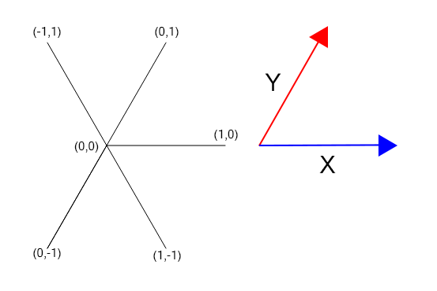
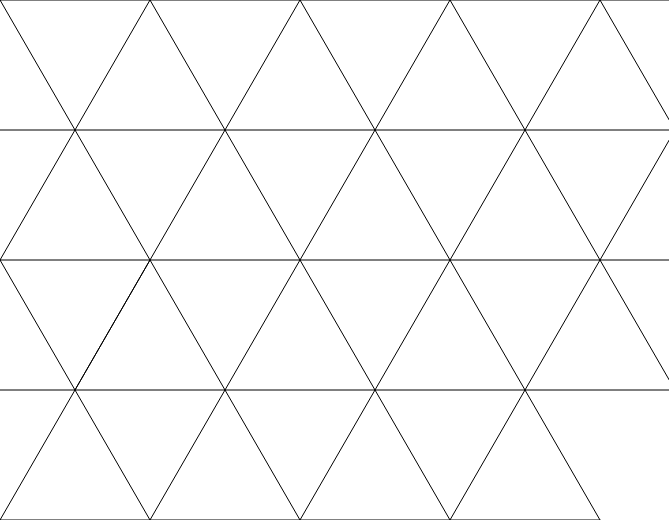
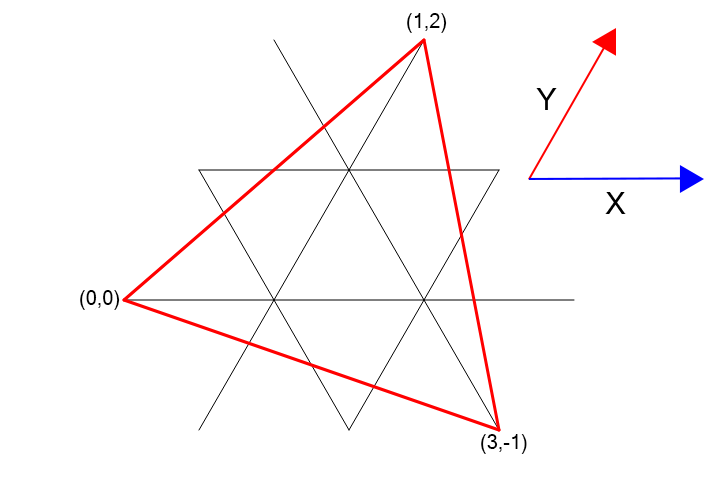
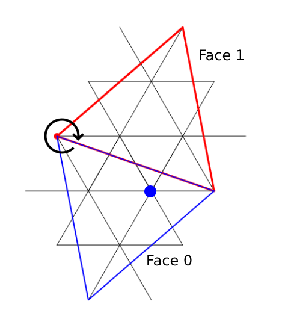
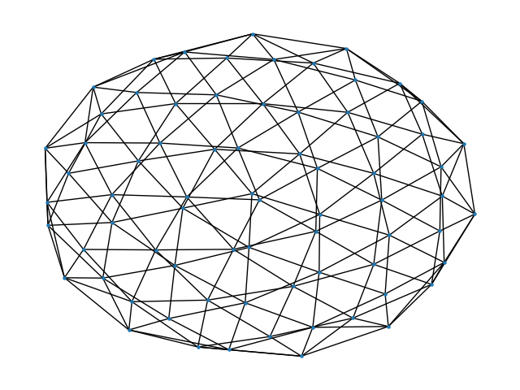

# Capsidlib
Capsidlib is a python library for generating and studying the graphs representing the protein subunit interaction networks of viral capsids.
# Required libraries
* The `networkx` library is used to handle operations on graphs.
* The `matplotlib`, `numpy` and `python-ternary` libraries are used to create figures.

# Graph analysis
The graph analyser module provides tools to compute information on the bond strength of different capsid graphs. This module requires networkx graphs with weighted nodes and can give insight into the ability of a capsid to resist both the removal of bonds (edges in the graph) and capsomers, i.e. protein units corresponding to the building blocks of the capsid (nodes in the graph).

## Unweighted graphs
### Fragmentation probability
For a graph that does not have weighted edges, the function `getFragmentationProbability` approximates the probability $p_f$ that the graph $G$ will fragment when a node or edge is removed with probability $f_r$. The value of $p_f$ is determined using a Monte Carlo method: for each simulation we determine whether or not to remove a node/edge with the built-in `random` function, and then check the connectivity of the graph using the networkx function `is_connected`. The number of simulations is determined by the dictionary `stopCondition`, which is defined as follows:  
It depends on the entry `conditionType`, which is a parameter that can take on two values:
* `fixedIterations`: stops once the number of iterations provided by `iterations` is reached;
* `bisection`: We check if the estimated for $p_f$ is closer to $p_f$ than to 0.5. If the probability that this is not the case is below `errorProbability`, it stops. This is done by stopping if the following inequality is true after a simulation : $4N|\frac{S_N}{N}-0.5|^2>\frac{1}{\epsilon}$ (where $\epsilon$ is the upper bond of the probability of error, $S_N$ the number of simulations that led to a fragmented graph and $N$ the number of simulations, for more details on this see the paper). As the number of iterations required to attain a probability underneath this threshold is potentially unbounded, a maximum of iterations is set (default value is 10000000), after which the program automatically returns the current estimation. A minimum amount of iterations can also be provided, the default value being 1000.
The first value returned is the estimation of the percolation threshold, and the second one indicates whether or not the maximum number of iterations has been reached. 

### Percolation threshold
The function `getPercolationThreshold` uses the bisection method to approximate the threshold probability of removal for which the probability of fragmentation is 0.5, i.e the percolation threshold. The parameter `errorProbability` provides an upper for the predicted value being correct. This routine uses `getFragmentationProbability` to determine whether or not the probability of fragmentation for a given probability of removal is above or below 0.5 with a high enough probability.  Minimum and maximum numbers of iterations for each bisection step can be provided as well. If the maximum number of simulations is reached before the probability condition is met, the bisection algorithm stops.

## Weighted graphs

### Removing edges
The energy of each bond is stored as the `energy` attribute of the corresponding edge in the graph. When removing edges in the graph we take into account this energy by attributing probability weights to each edge. This weight is defined as being proportional to the inverse of the energy. 
In order to remove a certain “energy amount” from the capsid, we define the notion of fragmentation probability by repeating following procedure:
* We first randomly pick an edge from the graph using the build it `choices` function from the `random` library.
* We then remove the energy of this bond from the total, thus computing the amount of energy that is left to remove.
* We remove the corresponding bond from the list of remaining bonds.
* We repeat this process as long as there is a bond in the graph that has less energy than the amount we have yet to remove.
* Once we are no longer able to remove edges, we determine whether or not the graph is fragmented using the `networkx` method for both removing edges and checking the connectivity of the graph.  

The function `getFragmentationWeightedProbabilityEdges` computes this value by using a Monte Carlo method: the previously described procedure is repeated multiple times until the stop condition is fulfilled to approximate the fragmentation probability. 
The number of iterations is again defined by `stopCondition` (the entries of which are the same as in `getFragmentationProbability`).

The function `getEnergyPercolationThresholdEdges` approximates the energy percolation threshold (i.e., the “energy” to remove in order to obtain a probability of fragmentation of 0.5) by using the same bisection method as `getPercolationThreshold`, using `getFragmentationWeightedProbabilityEdges` for each step.

### Removing nodes
The “energy of a node” is defined as the “energy” needed to remove it, i.e as the sum of the energies of all edges adjacent to it. The method for removing nodes is similar to the one for removing edges: the probability weight of each node is proportional to the inverse of its energy. Here the energy of each node is stored as a networkx attribute. The main difference being that as a node gets removed, the energies of the neighbouring nodes have to be decreased by the energy of the edges that were linked to them via the removed node. This process can also leave isolated nodes that have an energy of zero, with undefined probability weights. This situation is avoided by removing isolated neighbours as well as the chosen node.  
Note that the `getFragmentationWeightedProbabilityNodes` and `getEnergyPercolationThresholdNodes` functions are, respectively, similar to `getFragmentationWeightedProbabilityEdges` and `getEnergyPercolationThresholdEdges`.


# Graph generation
The graph generation module provides tools for generating the graphs representing the protein subunit interaction networks of viral capsids. This module can generate graphs of  triangular faces of a viral capsid, as well as graphs representing the interaction network of a viral capsid.


## Generation of a triangular face
A face in the capsid graph is generated by starting with a list of edges forming a tile, as well as the two translation vectors $\vec{T_x}$ and $\vec{T_y}$ that translate this tile such that the translated copies tile the plane with regularly spaced 6-fold symmetry axis ((0,0) being one of them). A rescaled equilateral triangular face is then "cut out" from this tiling as follows: The three vertices of the triangle must be chosen to coincide with 6-fold symmetry axes. The position of this triangle is defined by two integers $(h,k)$ such that $(h \vec{T_x}, k \vec{T_y})$ is the vector from (0,0) to another vertex of the triangle. The function `createFaceEdges` automates this algorithm. The three parameters required are the edges defining the tile, the translation vectors $\vec{T_x}$ and $\vec{T_y}$, and the values for $h$ and $k$.  
For instance, the following code generated a face tiled with triangles.  
```python
    tile = [
        ((0,0),(0,1)),
        ((0,0),(-1,1)),
        ((0,0),(-1,0)),
        ((0,0),(0,-1)),
        ((0,0),(1,-1)),
        ((0,0),(1,0)),
    ]
    Tx = (1, 0)
    Ty = (0,1)
    faceEdges, axis = createFaceEdges(tile,Tx,Ty,1,2)
```
The tile drawn in Cartesian coordinates can be seen below  
  
Which gives the following tiling  
  
The function returns only the edges inside the defined triangle  
  
which corresponds to the following edges and vertices delimiting the face
```python
faceEdges = [((1, 0), (1, 1)), ((1, 1), (1, 2)), ((1, -1), (1, 0)), ((2, 0), (2, 1)), ((2, -1), (2, 0)), ((1, 0), (0, 1)), ((1, 1), (0, 2)), ((2, 0), (1, 1)), ((2, -1), (1, 0)), ((3, -1), (2, 0)), ((1, 0), (0, 0)), ((1, 1), (0, 1)), ((2, 0), (1, 0)), ((2, 1), (1, 1)), ((3, 0), (2, 0)), ((1, 0), (1, -1)), ((1, 1), (1, 0)), ((1, 2), (1, 1)), ((2, 0), (2, -1)), ((2, 1), (2, 0)), ((0, 1), (1, 0)), ((0, 2), (1, 1)), ((1, 0), (2, -1)), ((1, 1), (2, 0)), ((2, 0), (3, -1)), ((0, 0), (1, 0)), ((0, 1), (1, 1)), ((1, 0), (2, 0)), ((1, 1), (2, 1)), ((2, 0), (3, 0))]
faceVertices = ((0, 0), (1, 2), (3, -1))
```  

## Graph generation
Given one triangular face of an icosahedron as described above, the graph of an icosahedral surface lattice is obtained as follows. By copying this face 20 times and merging nodes such that those 20 triangles match at the icosahedral edges, we generate the graph of the corresponding capsid. This construction is done with the help of a dictionary that associates to each node the face(s) associated with it, along with its coordinates inside each face. Initially every node only belongs to one triangular face, and this information is stored in terms of its coordinates inside that face. To glue two triangular faces $F_0$ and $F_1$ together, we first rotate all the points of $F_0$ by 60 degrees along one of the triangular vertices. Then for each point in $F_0$, we search for a point in $F_1$ with the same coordinates. If such a point is found, those points are merged. For this, they are retained as a single node in the graph, and their coordinate lists in the dictionary are concatenated.  
  
Once all 20 triangular faces have been correctly assembled into an icosahedral surface lattice, the associated graph is fully assembled. In our example, the graph looks like this (graph visualised with the `draw` function of networkx)  
  
This construction is implemented in the function `createCapsidGraph` which takes the following parameters as input:
*  `faceEdges` : a list of edges corresponding to the edges of a triangular face;
* `triangleVertices` : the three vertices delimiting the faces (tuple of 3 points);
* `bondStrength` : optional, this list needs to have the same length as `faceEdges`. This parameter defines the bond energy of every vertex of the capsid graph, where  `bondStrength[i]` corresponds to the energy of the bond `faceEdges[i]`.

## Notes
This algorithm for generating graphs is implemented here with icosahedral capsids, but this algorithm could be extended to work with other platonic solids by using a different coordinate system and adapting the way the faces are assembled together.
